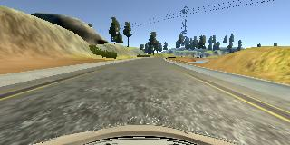
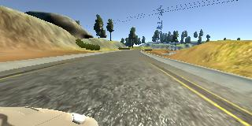

# **Behavioral Cloning Project**

The goals / steps of this project are the following:
* Use the simulator to collect data of good driving behavior
* Build, a convolution neural network in Keras that predicts steering angles from images
* Train and validate the model with a training and validation set
* Test that the model successfully drives around track one without leaving the road
* Summarize the results with a written report


### Rubric Points
##### Here I will consider the [rubric points](https://review.udacity.com/#!/rubrics/432/view) individually and describe how I addressed each point in my implementation.

### Example Images





---
### Files Submitted & Code Quality

#### 1. Submission includes all required files and can be used to run the simulator in autonomous mode

My project includes the following files:
* clone.py containing the script to create and train the model
* drive.py for driving the car in autonomous mode
* model.h5 containing a trained convolution neural network 
* writeup_report.md summarizing the results

#### 2. Submission includes functional code
Using the Udacity provided simulator and my drive.py file, the car can be driven autonomously around the track by executing 
```
python drive.py model.h5
```

#### 3. Submission code is usable and readable

The clone.py file contains the code for training and saving the convolution neural network. The file shows the pipeline I used for training and validating the model, and it contains comments to explain how the code works.

In my case, it was not necessary to use a Python generator to generate the training data, because my GPU had enough memory to store all of the training data. However, if I were to have a larger training data set such that the GPU did not have enough memory, one method to solve this would be to use a Python generator. The generator works by loading and preprocessing data on the fly, so that it does not have take up storage space in the GPU.

### Model Architecture and Training Strategy

#### 1. An appropriate model architecture has been employed

My model consists of a convolution neural network with 5x5 filter sizes and depths of 6. I also used max pooling after each of the convolutional layers. The convolutional layers include RELU activation to introduce nonlinearity (`clone.py` lines 52-63) 

The data is normalized beforehand in the model using a Keras lambda layer (`clone.py` line 54). The images are also cropped to cut out the parts of the image which are not necessary for determining steering angle (the hood of the car and the sky) (`clone.py` line 55) 

#### 2. Attempts to reduce overfitting in the model

I did not find it necessary to add a dropout layer for the purpose of reducing overfitting. 

Howver The model was trained and validated on different data sets to ensure that the model was not overfitting. We held out a fifth of the data for validation (`clone.py` line 66) The model was tested by running it through the simulator and ensuring that the vehicle could stay on the track.

#### 3. Model parameter tuning

The model used an adam optimizer, so the learning rate was not tuned manually (`clone.py` line 65).

#### 4. Appropriate training data

Training data was chosen to keep the vehicle driving on the road. In my data set I utilized the images collected by the left, center and right images. 

For details about how I created the training data, see the next section. 

### Model Architecture and Training Strategy

#### 1. Solution Design Approach

The overall strategy for deriving a model architecture was to first design the model after a more well known convolutional neural network, namely the Lenet-5 architecture. I thought this model might be appropriate because it is well known for its use in image recogniction.

In order to gauge how well the model was working, I split my image and steering angle data into a training and validation set. I found that the model did not have too much trouble with overfitting. However I did find that after around 5 epochs, the validation loss did not change much. I had initially used 10 epochs, so I cut this down to 5, significantly decreasing the training runtime.

On the first run, I found that the car consistently veered off to left pretty shortly after starting. To combat this, I chose to utilize the left and right camera images as well. In adding the left and right images I added a correction term to the steering wheel angle (`clone.py` line 26-28). I also added normalization of the data before running the convolutions. This did help the car stay on track longer, though not for a whole lap. 

A new problem I noticed was that, while the car drove better, it had a harder time turning to the left than it did the right. For this reason, I made the correction on one side slightly larger than the other. 

At this point, the car ran relatively well, but would consistently fail at the first turn following the bridge. I made two small adjustments to fix this. Prior to this point, I had set the number of epochs to just 3 for faster training. However, I was losing some accuracy because of this. So the first change I made was to increase the number of epochs to 5. The second thing  I saw was cv2's imread function read's the image as BGR as opposed to RGB, so I simply coverted the images from BGR to RGB using cv2's built in functionality. 

After training this updated model, the car was then able to traverse the track successfuly!

#### 2. Final Model Architecture

The final model architecture (model.py lines 18-24) consisted of a convolution neural network with the following layers in this order:
	- convolution layer with RELU activation (`clone.py` line 56)
	- max pooling layer (`clone.py` line 57)
	- convolution layer with RELU activation (`clone.py` line 58)
	- max pooling layer (`clone.py` line 59)
	- flatten and condensing layer (`clone.py` line 60-63)

#### 3. Creation of the Training Set & Training Process

To capture good driving behavior, I recorded two laps on track one using center lane driving. However, in the end I found that the driving in the provided training set was superior to my own, so I used that data set.

To augment the data sat, I flipped the images horizontally to produce additional data that would be equivalent to driving the car on the track in the opposite direction. 


After the collection process, I had over 48,000 data points. I then preprocessed this data by first normalizing it, then cropping the image.

I finally randomly shuffled the data set and put 20% of the data into a validation set. 

I used this training data for training the model. The validation set helped determine if the model was over or under fitting. The ideal number of epochs was 5. When I used 3 epochs, the accuracy could still be improved, and the car was unable to make it around the track. At 10 epochs, the decrease in validation loss became minimal. I used an adam optimizer so that manually training the learning rate wasn't necessary.
